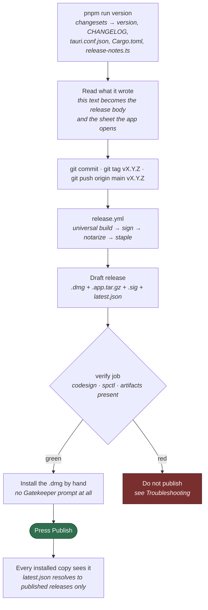

# Releasing Looped Plans

Looped Plans ships as a signed and notarized macOS `.dmg` and a Windows
installer, both built by
[`.github/workflows/release.yml`](.github/workflows/release.yml). This document
covers the per-release routine; the Windows half has its own section below.
The one-time setup for macOS (certificates, the App Store Connect key, the
updater keypair) is done, and lives in this file's history if it ever needs
doing again.

Signing and notarization are not optional polish: an unsigned build downloaded
from the internet is quarantined by Gatekeeper and shows up as *"Looped Plans is
damaged and can't be opened"* on anyone else's Mac. The workflow is built so
that a broken signature fails CI rather than a user's machine.

---

## The secrets it runs on

Set under **Settings → Secrets and variables → Actions**. Creating them was a
one-time job and is done; this is here so a failure has a name to point at.

| Secret                               | Value                                               |
| ------------------------------------ | --------------------------------------------------- |
| `MACOS_CERTIFICATE_P12_BASE64`       | base64 of the Developer ID Application `.p12`       |
| `MACOS_CERTIFICATE_PASSWORD`         | the password set when exporting the `.p12`          |
| `APPLE_SIGNING_IDENTITY`             | e.g. `Developer ID Application: Your Name (TEAMID)` |
| `APPLE_API_KEY_ID`                   | App Store Connect key id                            |
| `APPLE_API_ISSUER_ID`                | issuer id for that key                              |
| `APPLE_API_PRIVATE_KEY_BASE64`       | base64 of the `.p8` private key                     |
| `TAURI_SIGNING_PRIVATE_KEY`          | contents of `~/.tauri/plans.key`                    |
| `TAURI_SIGNING_PRIVATE_KEY_PASSWORD` | the password set when generating it, or empty       |

Two of these expire or are unrecoverable, which is the whole reason the table
survived the setup being done:

- **The Apple certificate expires**, typically after five years, and the
  workflow starts failing at the signing step when it does. Regenerate it and
  update the two `MACOS_*` secrets.
- **The updater private key cannot be regenerated.** Its public half is pinned
  in `src-tauri/tauri.conf.json` and compiled into every binary ever shipped. A
  new keypair means every installed copy stops seeing updates, silently and
  permanently. Keep the backup of `~/.tauri/plans.key` somewhere that is not
  this repo.

---

## Cutting a release



Everything above the **Publish** press is reversible: a draft release can be
deleted and the tag moved. That press is the only step that is not, because it
is the one the updater feed can see.

1. Collect the changesets into a version and a changelog:

   ```sh
   pnpm run version
   ```

   That runs `changeset version` — which consumes everything in `.changeset/`,
   bumps `package.json`, and writes `CHANGELOG.md` — and then
   `scripts/sync-version.mjs`, which copies the new version into
   `src-tauri/tauri.conf.json`, `src-tauri/Cargo.toml` and `Cargo.lock`, and
   regenerates `src/release-notes.ts` so the app can show its own notes offline.

   Read what it wrote. The changelog section becomes the GitHub release body and
   the sheet the app opens after updating, so this is the moment to fix a note
   that reads badly. CI fails the build if the versions ever disagree
   (`pnpm run version:check`).

2. Commit, then tag and push the version that was just cut:

   ```sh
   git commit -am "Release 0.2.0"
   git tag v0.2.0
   git push origin main v0.2.0
   ```

3. The workflow builds, signs, notarizes, staples, and creates a **draft**
   release. Notarization is Apple-side and usually takes a few minutes.

4. The `verify` job mounts the real `.dmg` and runs `codesign` and `spctl`
   against it, and checks that the release carries `latest.json`, the
   `.app.tar.gz` and its `.sig`. If it goes red, do not publish — see
   *Troubleshooting*. A release missing its updater artifacts looks completely
   fine and is simply invisible to every installed copy.

5. Download the `.dmg` from the draft release, open it, drag Looped Plans to
   Applications, and launch it once. It should open with no Gatekeeper prompt
   at all.

6. The release body is already written, from `CHANGELOG.md`. Read it, then
   **Publish** — that press is what makes the release visible to
   `releases/latest/download/latest.json`, and so to every installed copy.

### Building without releasing

Run the workflow manually from the Actions tab (`workflow_dispatch`). It builds
and signs exactly as a tagged run does, but creates no release — the `.dmg`
lands as a workflow artifact you can download and test. Use it to check a
signing change without spending a version number on it.

---

## Windows

The same tag builds a second installer, `Looped Plans_X.Y.Z_x64-setup.exe`,
on a `windows-latest` runner. It is x64 only for now; Windows-on-ARM would
be a second job and a second `latest.json` entry, and nobody has asked yet.

What is the same as macOS: the `build-windows` job runs the same
`tauri-action` step against the same tag, so the installer and its `.sig`
land on the same draft release, and `latest.json` gains a `windows-x86_64`
entry beside the darwin one. The updater signature comes from the same
`TAURI_SIGNING_PRIVATE_KEY`; it is minisign, so there is no second key to
keep. Installed Windows copies take updates through the same Publish gate.

What is different: the installer is not code-signed. There is no Windows
certificate, so the first launch of a downloaded installer shows SmartScreen's
"Windows protected your PC" with the real button behind *More info*. That is
the honest state until someone buys an OV certificate or sets up Azure
Trusted Signing, and the `verify-windows` job checks only what is actually
promised: the `.exe` and its `.sig` exist, and the feed carries the
`windows-x86_64` entry. It says nothing about Authenticode because there is
none to check.

The Windows job runs after the macOS one rather than beside it. Both upload
a `latest.json`, and the second upload merges into the first; two at the
same moment would each read the feed before the other wrote it.

Before publishing, run the smoke checklist on a Windows machine, since
nothing in CI exercises the Windows binary beyond building it:

- Install from the `.exe`; the app opens with a native title bar.
- Add a repository, open a plan, edit it, watch the git status update
  without a console window flashing.
- Start an agent turn with Claude Code installed through npm.
- Open in terminal opens Windows Terminal, or a console when `wt` is absent.
- Install the previous release, then take the update to this one.

Not in v1: repositories under `\\wsl$\...`. UNC paths through the file
watcher, git and the path checks are their own project, and the release
notes should say so rather than let it be a surprise.

---

## What the workflow actually does

| Step                                                | Why                                                                                                                                                            |
| --------------------------------------------------- | -------------------------------------------------------------------------------------------------------------------------------------------------------------- |
| Universal build (`--target universal-apple-darwin`) | One download that runs on both Apple Silicon and Intel, rather than an arch the user has to pick correctly.                                                    |
| `tauri-action` with `APPLE_CERTIFICATE*`            | Tauri imports the `.p12` into a temporary keychain and signs the app with hardened runtime enabled.                                                            |
| `.p8` written to `$RUNNER_TEMP`                     | Tauri wants the notarization key as a file on disk. `$RUNNER_TEMP` is wiped when the job ends and never lands in an artifact.                                  |
| Notarize + staple                                   | Stapling embeds Apple's ticket in the bundle so the app launches offline without a Gatekeeper round-trip.                                                      |
| Draft release                                       | Nothing reaches users until someone opens it, checks the installer, and publishes — which is the update gate too, since the feed only sees published releases. |
| Updater artifacts + `latest.json`                   | The `.app.tar.gz` and its signature are what an installed copy downloads; `latest.json` is the feed it reads. The `.dmg` remains the first-install path.       |
| Separate `verify` job                               | Signing fails subtly — wrong identity, or notarized without stapling. Verifying the real artifact with Apple's own tooling beats trusting the build log.       |

Signing degrades gracefully: with no certificate secrets the build still runs
and produces an unsigned app, so a manual run never blocks on secrets that
aren't set up yet. That build is for local testing only — the `verify` job
fails any *tagged* release that isn't properly signed.

---

## Troubleshooting

**`No signing certificate found` / signing step fails**
The `.p12` is missing its private key, or `APPLE_SIGNING_IDENTITY` doesn't match
the cert byte-for-byte. Re-export from Keychain Access selecting the key, and
copy the identity string out of `security find-identity -v -p codesigning`.

**Notarization returns `Invalid`**
Apple's log says exactly why. Fetch it locally:

```sh
xcrun notarytool log <submission-id> \
  --key AuthKey_XXXXXXXX.p8 --key-id <KEY_ID> --issuer <ISSUER_ID>
```

The usual causes are an unsigned nested binary or a missing hardened runtime
flag on something Tauri bundled.

**`spctl` rejects the app but `codesign` passes**
The app is signed but the notarization ticket wasn't stapled — the app will work
on the build machine and fail on a machine that's offline or has never seen it.

**Nobody is getting the update**
Check the published release actually has `latest.json`, `*.app.tar.gz` and
`*.app.tar.gz.sig` attached, and that the release is *published* rather than a
draft — the feed only ever resolves to a published release.

```sh
curl -sL https://github.com/loopedautomation/plans/releases/latest/download/latest.json
```

**`Signature error` when installing an update**
The updater public key in `tauri.conf.json` does not match the private key that
signed the archive. If `TAURI_SIGNING_PRIVATE_KEY` was regenerated, the pinned
public key has to change with it — and every copy installed before that change
will never update again.

**"Looped Plans is damaged and can't be opened" on a user's Mac**
That's the quarantine message for an unsigned or unnotarized download. Confirm
against the shipped artifact:

```sh
spctl --assess --type execute --verbose=4 "/Applications/Looped Plans.app"
xcrun stapler validate "/Applications/Looped Plans.app"
```

---

## Not yet covered

- **Windows code signing.** The installer ships unsigned; see *Windows*
  above for what that means and the two ways out of it.
- **Windows on ARM.** x64 only. A second target and a second feed entry when
  someone needs it.
- **Linux.** `bundle.targets` is `"all"`, but no job builds it. It needs its
  own runner and a decision about AppImage against `.deb`.
- **Staged rollout.** `latest.json` can carry a percentage, which is real
  insurance against shipping a bad build to everyone at once and meaningless
  with a handful of users. Revisit when there are enough installs for a
  percentage to mean anything.
- **Per-arch updates.** Every update is a universal binary, so it is both
  architectures. Per-arch feeds halve the download at the cost of a second build
  matrix and a second thing to get wrong.
- **Homebrew cask.** `looped/whisper` pushes a cask to a tap on each release;
  Looped Plans has no tap wired up.

