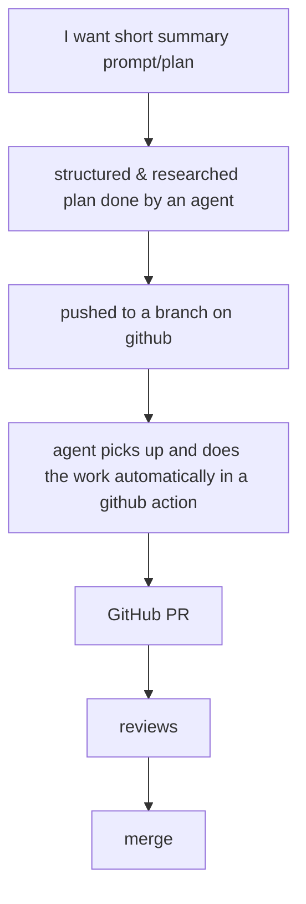

# The Software Factory: A Worker And A PR Skill

Now that we have the plans app working nicely, i want to focus a bit on how
the implementation of a plan gets done.

My ideal scenario is something like this:



The ambition behind the diagram is a **software factory**: the plans folder is
the queue, the statuses are the board, something picks work off the board and
turns it into PRs, and the human's job contracts to writing intent at one end
and reviewing diffs at the other.

There are two things to get right, and they are separable: **the skill** (how
any agent turns a plan into a PR — worktree, branch, scope, the lifecycle) and
**the worker** (the process that watches repos and starts those runs). The
skill is the portable part; get it right and the worker is a deployment
detail — a local daemon today, a GitHub Action later, the same text either
way. That is the same separation the app already makes: the conventions ship
as skill files and the hosts differ only in where a copy goes
(`skill.ts:5–14`).

## Most of the pipeline already exists

Worth mapping the diagram onto the codebase before designing anything.

- **A → B** is [`agents-flesh-out-plans.md`](./agents-flesh-out-plans.md),
  which shipped: the app builds the handoff command (`HANDOFF_PROMPT`,
  `agent.ts:16`) and starts an agent on the open plan, and the chat panel can
  do the same in-app.
- **B → C** is the git panel: `git_create_branch` (`lib.rs:1201`), commit,
  `git_push` (`lib.rs:1125`), wired through `api.ts:275–291`. In the factory
  version C can even be just "merged to the default branch as a `ready` plan"
  — the plan travels with the code, and the worker finds it there.
- **E → F → G** is GitHub's product, not ours.

So this plan is only **D** — and D splits into the skill and the worker.

## First thing: the PR skill

A third bundled skill, `skills/pr/SKILL.md`, beside `plans` and `review`,
registered in the `SKILLS` table (`skill.ts:32`) so the app installs it the
same way and can never drift from it. It is the implementation-side
counterpart of the plans skill: that one teaches an agent to *write* the
board; this one teaches an agent to *work* it. What it must say:

- **Pick one unit of work.** One `ready` plan — or one folder of related
  plans named after a feature (`plans/feature-name/*.md`), taken together,
  because plans that were split for readability still describe one change and
  one PR. Never two units in one run: a run maps to a branch maps to a PR,
  and a PR that implements two unrelated plans is unreviewable. The folder
  convention needs documenting in `skills/plans/SKILL.md` too — today the
  only folders with meaning there are `complete/` and `drafts/`.
- **Claim it first — and push the claim.** The very first act of a run,
  before any implementation: flip the plan to `busy`, commit that one-line
  change, and push it to the default branch. Per the lifecycle
  (`skills/plans/SKILL.md:38–43`) the claim is a note to the human; pushed,
  it becomes the mutual-exclusion lock between workers, and git's own push
  rejection is the arbiter — a non-fast-forward on the claim means another
  worker won the race, so pick a different unit and move on. This is the
  one deliberate exception to "never push to the default branch": a single
  frontmatter flip, nothing else in the commit, so the exception stays
  auditable as exactly that.
- **Work in a worktree.** `git worktree add` from the *latest commit of the
  default branch*, on a fresh branch named for the plan. The worktree is what
  makes a factory possible at all: the human's checkout is never dirtied, two
  units can build in parallel, and a failed run is discarded by deleting a
  directory. `agent-ux-bakeoff.md` already proved this folder's workflow
  survives worktrees.
- **Finish into a PR.** Verify (the smallest relevant check the repo offers),
  set `done`, push the branch, `gh pr create` into the default branch, the PR
  body linking the plan file it implements. Never merge, and never push to
  the default branch beyond the claim flip above.
- **Fail loudly, not creatively.** A plan that turns out underspecified goes
  back to `ready` with a note at the top saying what was missing — the plans
  skill's "no blocked status, write it in the file" rule, applied from the
  other side. No half-done PR.

The skill is prose an agent reads, so it works unchanged under `claude` in a
terminal, under the daemon, or inside an Action — which is the whole reason
to put the effort here rather than into the host.

## The builder is Claude Code, and the plan says how hard to think

The app's interactive handoff stayed agent-agnostic on principle —
`agentCommand` is a template precisely so the app ships no opinion about
which agent you use. The factory narrows that, deliberately, to **Claude
Code first**. A dispatcher needs things only a specific agent can promise:
a real non-interactive mode (`claude -p`), permission behaviour that can be
pinned per run rather than asked about, skills read from the repo's
`.claude/skills/` (where the app already installs them, `skill.ts:39`), and
— the part that makes routing possible — model and effort selectable per
invocation. Generalising the worker to other agents is a later abstraction
to earn, the same way the Action host is; the skill text stays
agent-neutral so nothing above this layer has to change.

A non-interactive session also settles the permissions question by force:
there is nobody at the other end of a prompt, so the run must **bypass
permissions** (`--dangerously-skip-permissions`, or a broad allowed-tools
grant — see below). That sounds like the scary version but it is the honest
one, and the safety story moves to where it already lives: the run is
contained in a throwaway worktree, it never merges and never pushes the
default branch beyond the one-line claim flip, its output is a PR a human
reads, and the spend was authorised by the `ready` flip. A permission prompt in a factory is not a safeguard, it is a
hang — the one thing the skill's fail-loudly rule exists to prevent.

We are not the first to hold this exact set of constraints. Anthropic's own
GitHub Action runs Claude Code headless in CI — same no-human-attached, same
"the PR is the review boundary" shape — so before writing our invocation,
**read how the action configures its runs** (permission strategy, tool
allowlist, how it passes model and prompt, how it bounds the run) and do the
same locally. Where it uses an allowlist rather than full bypass, that is a
finding worth copying, not a detail to skip; the worker should be the local
translation of a configuration that is already battle-tested in public,
rather than our own guess at it.

Which brings in the second half: not every plan deserves the same brain.
A rename sweep is a fast-model errand; a concurrency redesign wants the
best model thinking hard, and the price difference is real. The routing
belongs **in the plan's frontmatter**, because the plan is the work order
and the human already prices the work at the same moment they flip it to
`ready`:

```yaml
---
status: ready
model: opus
effort: high
---
```

- `model` and `effort` over `for` — `for:` reads as "for whom", and these
  are two independent dials (model tier; how long it may think), so they
  are two keys. Values pass straight through to the invocation
  (`claude -p --model opus …`), so the vocabulary is Claude Code's, not
  ours — the same stance `statusTone` takes on statuses: the app reads
  conventions, it does not own a vocabulary.
- The rule is firm, not advisory: a key that is present is respected, and a
  key that is missing falls back to the worker's configured default. No
  overrides in the worker's config, no heuristics about what the plan
  "looks like it needs" — the frontmatter is the contract, and the common
  plan carries nothing extra.
- Nothing in the app needs building for this. The frontmatter panel renders
  and edits arbitrary keys already, and `matterValue` / `setMatterValue`
  (`matter.ts:84`, `matter.ts:99`) read and write any top-level key by
  name — the worker reads the same two lines with a grep. At most, later,
  the palette grows a nudge for these keys the way it has one for status.
- For a feature folder, the folder is one run, so one setting must win:
  the highest requested effort and model in the folder, because the unit
  was priced by its hardest member.
- The keys bind the dispatcher, not the lifecycle — a hand-driven terminal
  session is you choosing your own model, and that is fine. Document them
  in `skills/plans/SKILL.md` beside the other frontmatter conventions.

## Second thing: the worker — our own CLI, run as a daemon

Not GitHub's runner, at least not first. A small CLI of ours — call it the
worker — that runs on the developer's machine, reads a config listing repos
to watch, and loops: fetch, scan the default branch's plans folder for
`ready` plans (and feature folders), pick one unit, and start the configured
agent on it with the PR skill. The agent does everything else; the worker is
a dispatcher, not an orchestrator.

The config is **its own file** — repos to watch, default model and effort,
poll interval — not a corner of the app's settings. The worker must run on
machines the app is not installed on, so the file cannot belong to the app;
the app can grow an editor for it later (a page beside Settings, or just
"open the file"), the same courteous-guest relationship it has with
repo-owned skill files. Location and format are the worker's to define;
the app adapts to it, not the reverse.

Why local-first rather than the Action the title asked for:

- **The machine is already provisioned.** Credentials, `gh` auth, language
  toolchains, warm caches, the user's `agentCommand` — a GitHub runner has
  none of these and each is YAML and secrets to recreate, per repo, forever.
- **Iteration speed.** The factory's early life is prompt-and-skill tuning.
  A local run fails in seconds in a terminal you can read; an Action fails in
  minutes in a log page, with a commit–push cycle per tweak.
- **Oversight survives.** `agents-flesh-out-plans.md` planted the flag that
  nothing runs without oversight. A worker started in your terminal (or a
  tmux window, per `tmux-sessions.md`) is visible, readable and killable in
  the ordinary ways; its runs can even be panes. Headless-in-the-cloud can
  come once the skill has earned trust locally.

And why this does *not* re-fight
[`agents-in-the-background.md`](./agents-in-the-background.md), which argued
hard against a daemon: that daemon would have been the *app's* — bundled,
notarized, speaking a third protocol, owning the app's live ACP sessions. The
worker is none of that. It is a separate tool the user runs deliberately,
supervised like any other process they start, and the app's only relationship
to it is the one it was built for: files and branches changing underneath it,
picked up by the watch loop (`App.tsx:799`) and the git panel. The app stays
a reader. If the worker dies, conversations are not lost — a `busy` plan with
no PR is the visible symptom, and re-running is the recovery.

What the worker is not: it does not parse agent output, does not manage
sessions, does not answer permission prompts (runs go through the agent's own
non-interactive mode; the skill is written so the run needs no questions).
Every capability it might grow — status, logs, concurrency — should first be
answered by "the board already shows that" or "tmux already does that".

## Hostable anywhere, and watchable from anywhere

Two questions about the worker's shape, answered together because the second
constrains the first.

**Can it run on another machine?** Yes, and nothing in the design has to
change to allow it — which is the test that the design is right. The worker's
dependencies are exactly four: git access to the remotes, `claude` with an
API key, `gh` auth, and its config file. None of those is the developer's
machine. It already works from its own clones and worktrees rather than the
human's checkout, so from the repo's point of view the worker was always
"another machine" — running it on a home server or a cloud box is a change
of address, not of architecture. That is also the honest answer to "the
laptop must be on" from the costs section, and it reframes the GitHub Action
below as merely the most managed point on a spectrum of hosts: laptop, your
server, their runner — one worker, one skill, three addresses.

**Does it need to be a separate thing?** Separate from the app: yes, and
more firmly than before — an app on your laptop cannot contain a process on
your server, and the moment the worker is remote, the app-as-reader stance
stops being a design preference and becomes the only option. But not a
separate *product*: it lives in this repo, ships the same bundled skills,
and the app is its natural (though never required) front end.

**Monitoring is two layers, and the first is already built.** The durable
state of the factory — what is claimed, what is done, what PRs exist — lives
in the repo itself: `busy` in a pushed claim, branches, PRs. Any clone of
the repo is a monitor, and the app's board already renders it. What the repo
cannot say is the *live* part: is the worker up at all, what is it doing
right now, is that `busy` a running agent or a stale claim from a crashed
run, what did the last run's log say. That is worth an endpoint — but a
deliberately small one:

- **Read-only HTTP, JSON.** `/state`: the repos watched, the run in flight
  (plan, model, effort, started-at), a short history of runs with their
  outcome and PR link, and the last error. `/logs/{run}`: the tail of that
  run's transcript, because `claude -p` output written to a file per run is
  the cheapest flight recorder there is. Nothing writable — dispatch stays
  with the board (flip to `ready` and push), so the endpoint cannot become
  a second control surface that competes with the files.
- **A stale `busy` becomes detectable** rather than a judgement call: a
  plan the repo says is claimed but the worker's state does not list as
  running is a crashed run, and that comparison is exactly the check the
  claim-race question below needs at PR time anyway.
- **Bound to localhost by default**; reaching it from elsewhere is the
  operator's business (a tailnet, an SSH tunnel), not ours — the moment we
  ship auth we have shipped a server product, and this is a status page.
- The app can later render `/state` as a rail badge or a panel — a worker
  URL in settings, polled like everything else the app polls — but that is
  sugar. `curl` is the smallest true version of the monitor, and the board
  remains the source of truth the endpoint only annotates.

## The GitHub Action, demoted but not gone

The diagram's D said "in a github action", and that stays on the map as the
second host: a thin workflow that checks out, installs the same PR skill, and
runs the same agent — either `workflow_dispatch` on a plan path, or triggered
by a plan *becoming* `ready` on push. Two things make it later rather than
first: the per-repo secret and cold-machine costs above, and a loop hazard —
an Action triggered by pushes that itself pushes is safe only while it uses
the default `GITHUB_TOKEN` (GitHub's recursion guard), and one PAT
substitution away from not being. The local worker has no such trap: it reacts
to the default branch, and the agent's branches never contain status flips to
`ready`.

## The honest costs

- **A second tool of ours.** A CLI is a build, a version, and a README —
  though not a signing/notarization problem if it stays a dev-machine tool
  installed from the repo. Smallest viable form: a script in `scripts/`
  before it is a product.
- **The machine must be on.** A local factory stops when the laptop sleeps.
  Acceptable for one developer, and answered without new architecture by
  hosting the same worker on a machine that stays up (above) — the Action
  is the fully-managed end of that spectrum.
- **The claim writes to the shared repo before any work exists.** Decided,
  and worth the cost: the pushed `busy` flip is the lock, and the price is
  a small commit on the default branch per run (two, counting nothing —
  the `done` flip travels in the PR). A crashed run leaves a pushed `busy`
  with no PR behind it; the endpoint comparison below is how that is
  noticed, and un-claiming is a human flip back to `ready`.
- **Cost per pick.** Every `ready` plan the worker sees becomes a paid agent
  run. The status flip is the spend button and the skill must treat it as
  deliberate.

## The smallest true version

1. **The skill alone.** Write `skills/pr/SKILL.md`, register it in `SKILLS`
   (`skill.ts:32`), and drive it by hand: tell a terminal agent "pick up a
   ready plan" in this repo and watch it worktree, implement, and open the
   PR. No worker exists; the human is the dispatcher. This is worth shipping
   alone and is where all the tuning happens.
2. **The worker as a loop.** A script watching this one repo: fetch, scan,
   pick, spawn `claude -p` with the skill and the plan's `model`/`effort`
   keys applied, wait, repeat. Config is a list of repo paths plus default
   model and effort for plans that carry neither.
3. **Feature folders.** Teach both skills the `plans/feature-name/` unit and
   run a multi-plan feature through end to end.
4. **The Action host**, once the skill has produced a run of good PRs
   locally.

## Open questions

- **Does the worker pick, or does the skill?** Simplest is: the worker picks
  the unit (it must, to schedule and to bound spend) and the skill says how
  to treat whatever it was given plus how to behave if picking for itself.
  The skill should stand alone for hand-driven runs.
- **What is "related" for a folder of plans** — everything in the folder not
  `done`? A folder half-implemented across two runs makes two PRs into the
  same feature; maybe a feature folder is one run, always, and plans inside
  it share fate.
- **How does review (F) feed back?** PR comments are outside the plans
  folder, so the board cannot see "changes requested". Does the worker watch
  its open PRs and re-dispatch on review comments — the loop that would make
  this a factory rather than a one-shot pipeline — or is responding to review
  a human-triggered run? This is where
  [`forge-pr-integration.md`](./forge-pr-integration.md) stops being
  optional.
- **Remote oversight.** The local-first argument leaned on "visible in your
  terminal". On a server that becomes tmux-over-SSH plus the endpoint —
  probably enough for a read-only status page, but the moment someone wants
  to *answer* a running agent remotely, that is a different feature and it
  is not this plan.
- **How does `effort` actually reach Claude Code headless?** Answered:
  `--effort <level>` is a real flag in the installed CLI, including under
  `-p` — frontmatter passes straight through, no settings workaround
  (see [`claude-code-action-findings.md`](./claude-code-action-findings.md)).
- **Verification depth.** "Smallest relevant check" is the repo's own
  business (`ci.yml` here), but the skill needs a rule for repos with no
  checks at all.

## Done when

- Flipping a plan to `ready` produces, with no further gesture while the
  worker runs, a PR into the default branch that implements it — built in a
  worktree from the latest default-branch commit, the plan reading `done`,
  the branch never having touched the human's checkout.
- A feature folder of related plans becomes one PR, not several.
- A plan the agent could not implement comes back `ready` with a note saying
  why, and no half-done PR exists.

## Next

- [x] Write `skills/pr/SKILL.md` — the unit rule (one plan or one feature
  folder), the pushed `busy` claim as first act and lock, worktree from
  the default branch's tip, PR into the default branch, fail-loudly —
  and register it in `SKILLS` (`skill.ts:32`)
- [x] Document the feature-folder convention and the `model` / `effort`
  frontmatter keys in `skills/plans/SKILL.md`
- [ ] Drive the skill by hand on a real small plan in this repo, through to
  the merged PR; tune until a run needs no questions
- [x] Read `anthropics/claude-code-action`'s source for its headless
  invocation — permission strategy (bypass vs allowlist), tool config,
  model and prompt plumbing, run bounds — and write down the local
  translation before the worker exists →
  [`claude-code-action-findings.md`](./claude-code-action-findings.md):
  allowlist + `--permission-mode acceptEdits`, never bypass; a
  `git-push.sh` wrapper instead of `Bash(git push:*)`; `--max-turns`
  enforced twice; `--effort` is a real CLI flag
- [x] The worker as a script in `scripts/`: config of repo paths + default
  model/effort, fetch–scan–pick–spawn loop around `claude -p`, one repo
  first — pinning down how `effort` is passed against the real CLI →
  `scripts/worker.mjs` + `scripts/git-push.sh`. It went one step past
  the plan: it also dispatches `draft` plans as flesh-out runs (plans
  skill, plans-only push to the default branch), so the human's whole
  gesture is "commit a draft" — the worker carries it draft → ready →
  PR. Config at `~/.plans-worker.json`, clones and logs under
  `~/.plans-worker/`; the push wrapper mechanically enforces
  "default branch takes plans/ changes only"
- [ ] Run a `plans/feature-name/` folder through as a single PR
- [ ] Per-run log files, then the read-only `/state` + `/logs/{run}`
  endpoint on localhost — `curl` is the monitor until the app grows a
  panel for it
- [ ] Run the same worker on a second machine against a scratch repo and
  watch the pushed claim's push-rejection arbitrate the race for real
- [ ] Later: an editor for the worker's config file in the app, beside
  Settings
- [ ] Decide the review-feedback loop (with `forge-pr-integration.md`)
- [ ] Only then: the GitHub Action as a second host for the same skill

